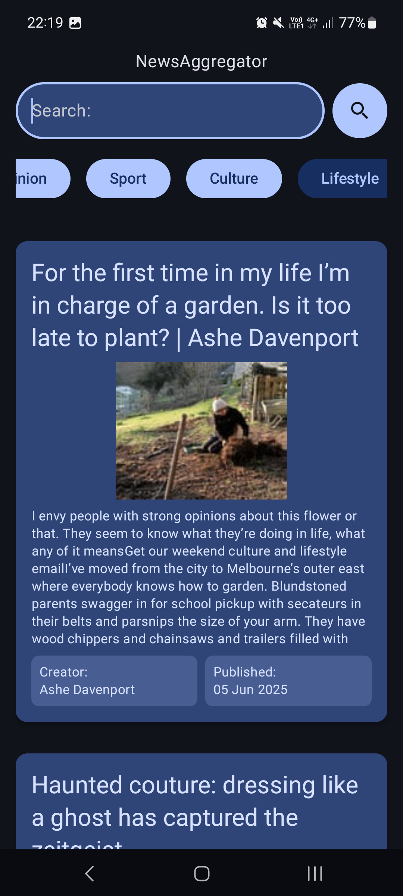
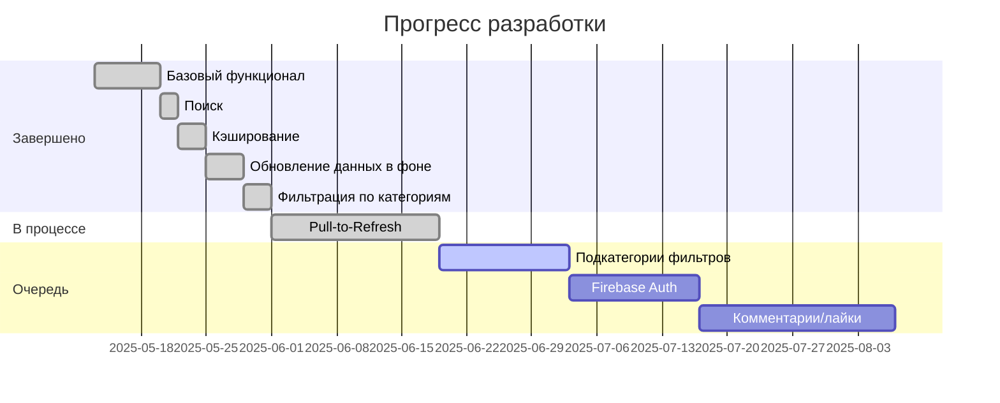

# 📰 NewsAggregator — Android-приложение для агрегации новостей  

[](https://kotlinlang.org)
[](https://opensource.org/licenses/MIT)
[](https://android-arsenal.com/api?level=21)

Приложение для удобного чтения новостей.  

<p align="center">
  
  
  
  
</p>

## 🔥 Возможности  
- 📡 Загрузка новостей из [The Guardian](https://www.theguardian.com/)
- 🔍 Поиск
- 🗂 Фильтрация по категориям
- 💾 Оффлайн-режим
- 🌙 Адаптивный UI (светлая/тёмная тема)
- 🔄 Pull to refresh


## 🛠 Технологии  
| Компонент       | Реализация                          |
|-----------------|-------------------------------------|
| **Язык**        | Kotlin                     |
| **Архитектура** | MVVM + Clean Architecture           |
| **UI**          | Jetpack Compose + Material 3        |
| **Сеть**        | Retrofit 2 + OkHttp         |
| **Локальная БД**| Room                 |
| **DI**          | Dagger Hilt                         |
| **Асинхронность**| Coroutines + Flow + StateFlow      |

## 🚀 Roadmap NewsAggregator




## 📊 Статус по задачам

| Функция                   | Готовность |
|---------------------------|------------|
| ✅ Базовый функционал     | 100%        |
| ✅ Поиск                  | 100%        |
| ✅ Кэширование            | 100%        |
| ✅ Обновление данных в фоне            | 100%        |
| ✅ Фильтрация по категориям            | 100%        |
| ✅ Pull-to-Refresh    | 100%        |
| 🟡 Подкатегории фльтров       | 0%         |
| ⚪️ Авторизация через Firebase      | 0%         |
| ⚪️ Лайки и комментарии через Firebase        | 0%         |

## 🚀 Запуск проекта  
1. Склонируйте репозиторий:  
   ```bash
   git clone https://github.com/niksaen-official/NewsAggregator.git
2. Откройте проект в Android Studio (версия Arctic Fox+).
3. Запустите приложение через эмулятор или устройство.
